# 🐾 Pet Alert Platform

El sistema permite registrar mascotas perdidas, reportar avistamientos, administrar cuidadores, visualizar ubicaciones en un mapa y recibir notificaciones, utilizando una arquitectura basada en patrones de diseño y buenas prácticas de desarrollo.

---

# Alumno

- Joel Benjamin Seminario Serna

---

# Objetivo

Desarrollar una plataforma que facilite el registro y localización de mascotas perdidas mediante una aplicación web organizada, modular y extensible.

---

# Tecnologías utilizadas

## Frontend

- React
- TypeScript
- Vite
- React Router
- React Leaflet
- Axios

## Backend

- NestJS
- TypeScript
- TypeORM
- SQLite
- Multer
- Express

## Base de datos

- SQLite

---

# Arquitectura

El proyecto sigue una arquitectura por capas.

```
Frontend (React)

↓

Controladores (NestJS)

↓

Servicios

↓

Patrones de diseño

↓

Repositorios

↓

Base de datos SQLite
```


---

# Funcionalidades

## Gestión de mascotas

- Registrar mascota perdida.

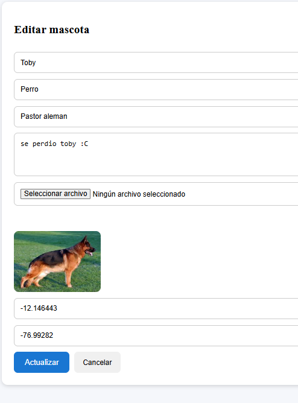

- Editar información.

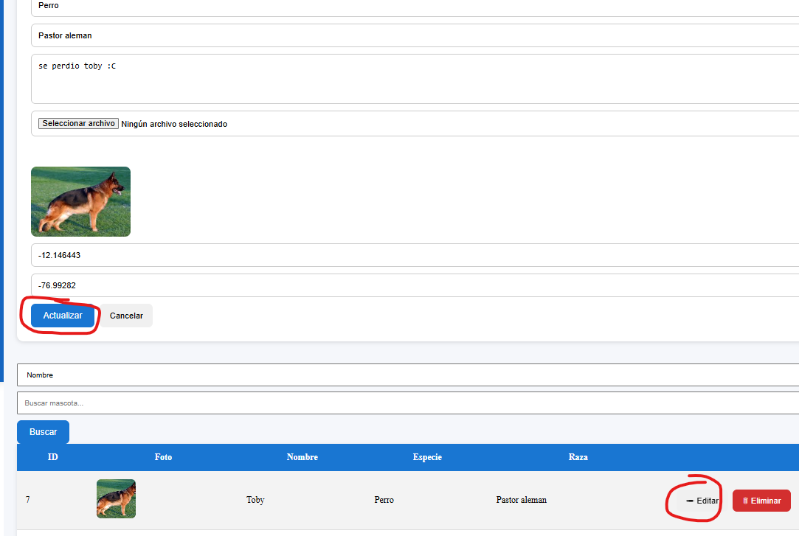

- Eliminar registro.

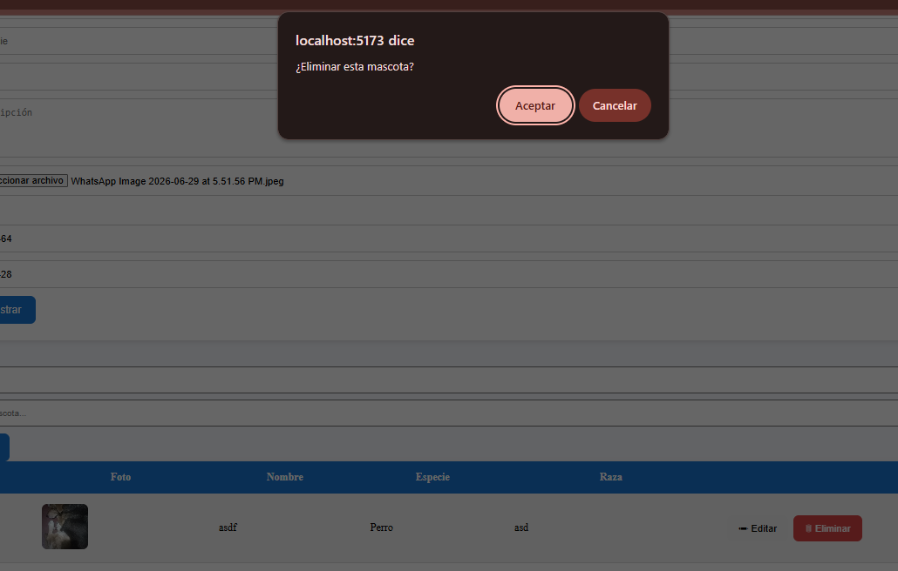

- Visualizar listado.

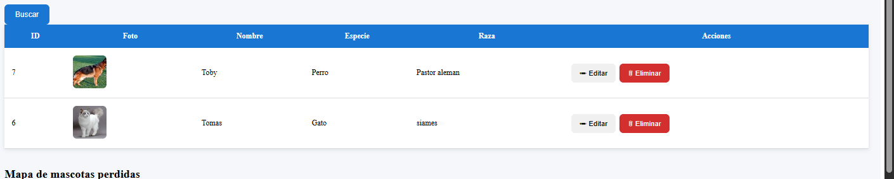

- Buscar por nombre.

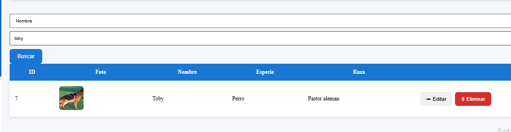

- Buscar por especie.

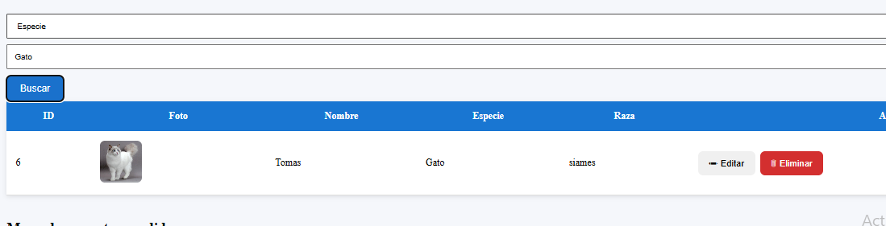

- Buscar por raza.

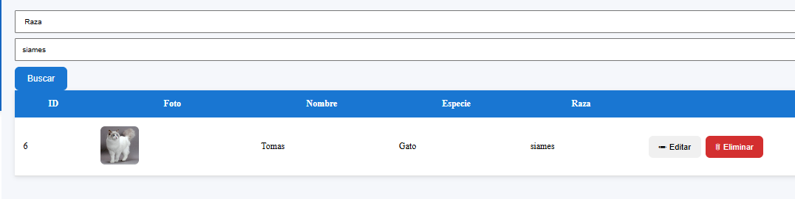
---

## Registro de avistamientos

- Registrar avistamiento.

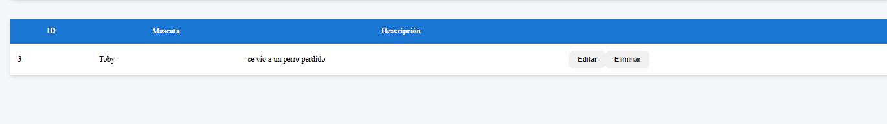

- Adjuntar fotografía.

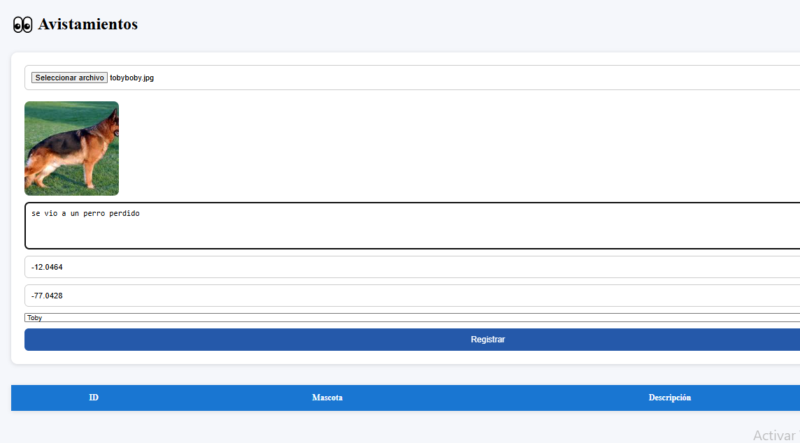

- Mostrar ubicación.

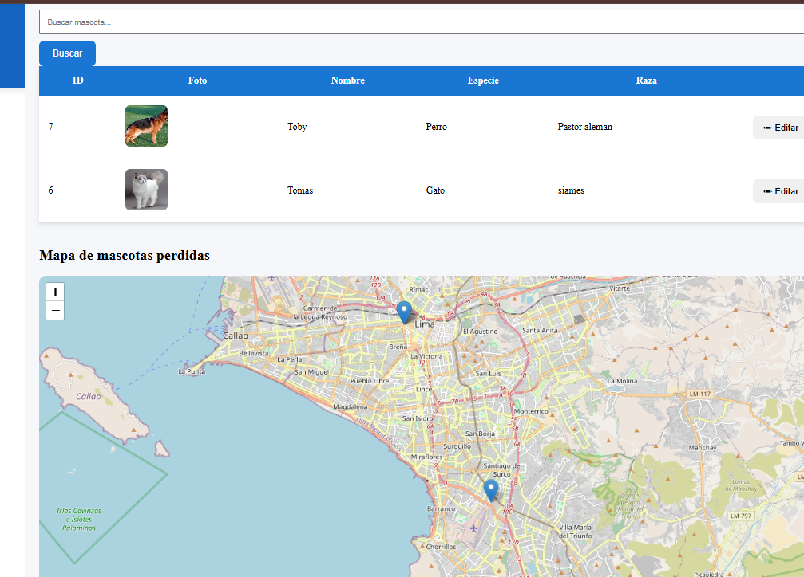

- Asociar avistamiento con una mascota.

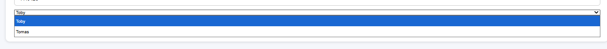
---

## Gestión de cuidadores

- Registrar cuidadores.

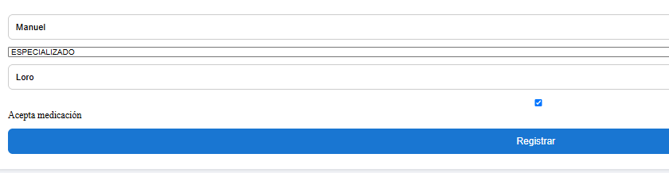

- Listar cuidadores.

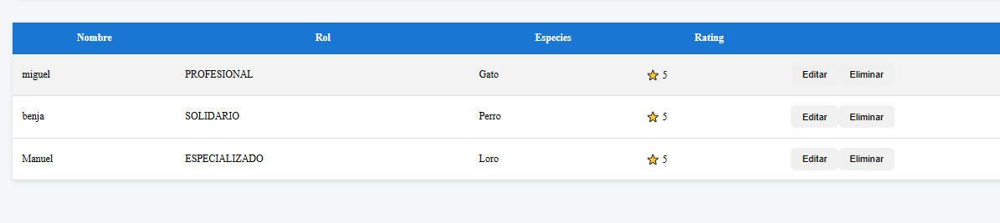

- Editar información.

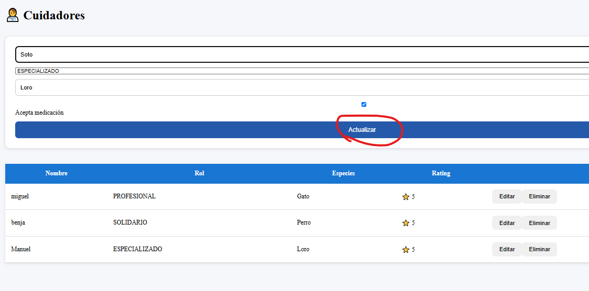

- Eliminar registros.

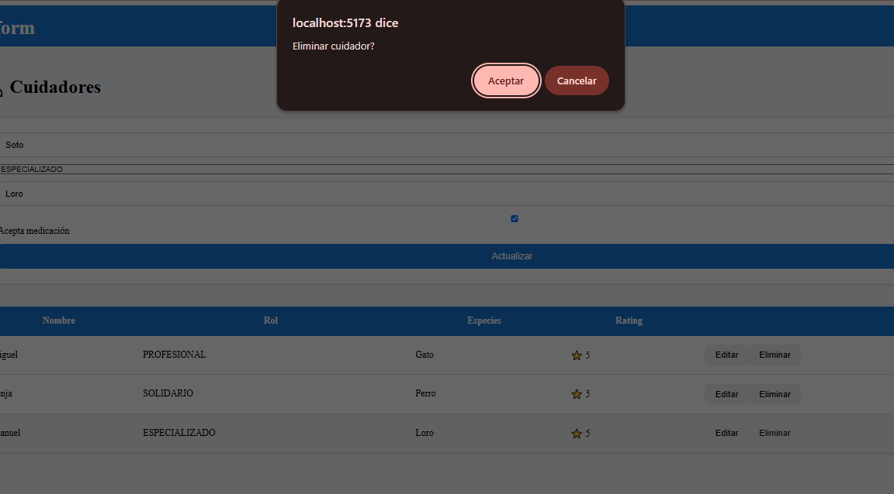

- Actualizar cuidador.

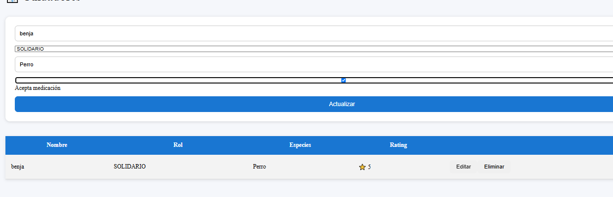
---

## Buscar mascota por imagen

- Seleccionar imagen.
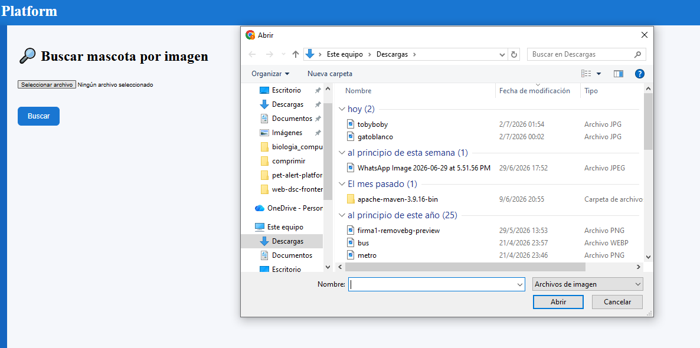

- Cargar imagen.

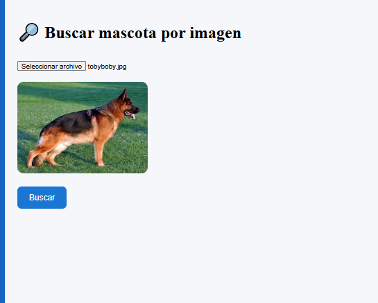

- Buscar/encontrar imagen.

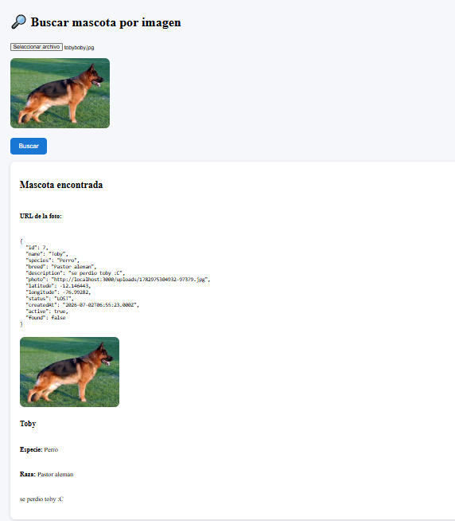

## Dashboard 
- Tabla de animales registrados

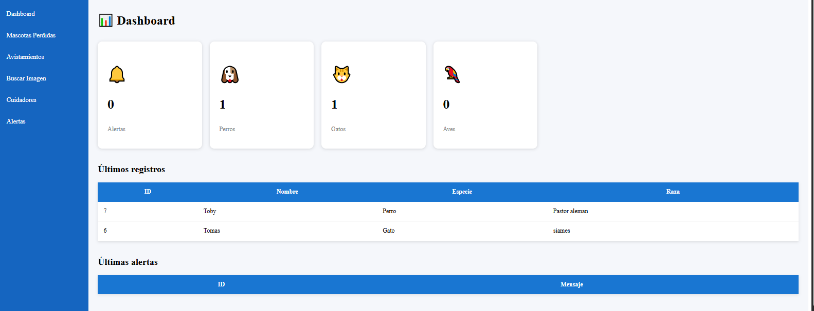

## Notificaciones

Cada vez que se registra una mascota perdida el sistema genera una notificación para los usuarios.

---

## Mapa interactivo

Mediante Leaflet se puede:

- seleccionar ubicación
- visualizar mascotas perdidas
- registrar coordenadas

---

## Subida de imágenes

El sistema permite subir fotografías mediante Multer. Las imágenes quedan almacenadas en el servidor y posteriormente son utilizadas por los distintos módulos.

---

# Patrones de Diseño Implementados

Uno de los principales objetivos del proyecto fue aplicar patrones de diseño estudiados durante el curso.

---

# Factory Pattern

## Objetivo

Centralizar la creación de objetos evitando instanciarlos directamente.

### Implementación

```
PetFactoryProvider
```

El Factory decide automáticamente qué tipo de mascota crear dependiendo de la especie registrada.

Ejemplo:

```
Perro

↓

DogFactory

↓

Objeto Pet
```

o

```
Gato

↓

CatFactory

↓

Objeto Pet
```

### Beneficios

- Reduce el acoplamiento.
- Facilita agregar nuevas especies.
- Centraliza la creación de objetos.
- Favorece el principio Open/Closed.

---

# Strategy Pattern

## Objetivo

Permitir diferentes algoritmos de búsqueda sin modificar el código principal.

### Estrategias implementadas

- NameStrategy
- SpeciesStrategy
- BreedStrategy

Todas implementan la misma interfaz.

```
SearchStrategy
```

El contexto utilizado es:

```
SearchContext
```

Durante la ejecución el sistema selecciona dinámicamente la estrategia apropiada según el criterio elegido por el usuario.

Ejemplo:

```
Buscar por nombre

↓

NameStrategy

↓

Resultados
```

o

```
Buscar por especie

↓

SpeciesStrategy

↓

Resultados
```

### Beneficios

- Algoritmos independientes.
- Fácil incorporación de nuevas búsquedas.
- Código limpio.
- Cumple Open/Closed.

---

# Observer Pattern

## Objetivo

Notificar automáticamente eventos importantes.

### Implementación

```
NotificationSubject
```

Cada vez que se registra una mascota nueva:

```
Registrar mascota

↓

NotificationSubject

↓

NotificationService

↓

Nueva notificación
```

No es necesario modificar el código de registro para agregar nuevos observadores.

### Beneficios

- Bajo acoplamiento.
- Comunicación entre módulos.
- Fácil incorporación de nuevos observadores.

---

# Repository Pattern

## Objetivo

Separar completamente el acceso a datos de la lógica de negocio.

Repositorio utilizado:

```
PetRepository
```

Responsabilidades:

- Crear
- Buscar
- Actualizar
- Eliminar

El resto del sistema nunca interactúa directamente con TypeORM.

### Beneficios

- Código desacoplado.
- Fácil mantenimiento.
- Facilita pruebas.

---

# Arquitectura Modular

El backend está organizado por módulos.

```
modules/

pets/

notifications/

caregivers/

sightings/

upload/
```

Cada módulo posee:

- Controller
- Service
- Repository
- DTO
- Entidades

Esto facilita el crecimiento del proyecto.

---

# Flujo de Registro de Mascotas

```
Usuario

↓

Formulario React

↓

PetController

↓

PetService

↓

PetFactoryProvider

↓

PetRepository

↓

SQLite

↓

NotificationSubject

↓

NotificationService
```

---

# Flujo de Búsqueda

```
Usuario

↓

Selecciona criterio

↓

SearchContext

↓

Strategy correspondiente

↓

Repositorio

↓

Resultados
```

---

# Flujo de Avistamientos

```
Usuario

↓

Formulario

↓

Subida de imagen

↓

Registro

↓

Base de datos
```

---

# Estructura del Proyecto

```
backend/

src/

database/

modules/

pets/

notifications/

caregivers/

sightings/

upload/

frontend/

src/

pages/

components/

services/

router/
```

---

# Principios SOLID aplicados

Durante el desarrollo se aplicaron varios principios SOLID.

## Single Responsibility Principle

Cada clase tiene una única responsabilidad.

Ejemplos:

- PetRepository
- NotificationService
- SearchContext

---

## Open / Closed Principle

Gracias a Strategy y Factory es posible extender funcionalidades sin modificar el código existente.

---

## Dependency Inversion Principle

Los servicios dependen de abstracciones y no directamente de implementaciones concretas.

---

# Base de Datos

Las principales entidades del sistema son:

- Pet
- Owner
- Caregiver
- Sighting
- Review
- Notification

Relaciones implementadas mediante TypeORM.

---

# Capturas del sistema

Se recomienda incluir imágenes de:

- Dashboard
- Registro de mascotas
- Registro de avistamientos
- Gestión de cuidadores
- Mapa
- Búsqueda
- Notificaciones

---

# Posibles mejoras futuras

- Búsqueda inteligente por similitud de imágenes.
- Reconocimiento mediante Inteligencia Artificial.
- Autenticación de usuarios.
- Roles y permisos.
- API REST documentada con Swagger.
- Integración con servicios en la nube.
- Notificaciones en tiempo real.
- Aplicación móvil.

---

# Conclusiones

Durante el desarrollo del proyecto se aplicaron diversos conceptos vistos en el curso de Desarrollo de Software, priorizando una arquitectura modular, mantenible y escalable.

El uso de patrones de diseño permitió separar responsabilidades, reducir el acoplamiento entre componentes y facilitar la incorporación de nuevas funcionalidades sin afectar el funcionamiento existente.

Asimismo, la utilización de tecnologías modernas como React, NestJS y TypeORM permitió construir una aplicación completa que integra interfaz web, servicios REST, almacenamiento de información, carga de imágenes y visualización geográfica, constituyendo una solución funcional para la gestión de mascotas perdidas.

---

# Ejecución

## Backend

```bash
cd backend

npm install

npm run start:dev
```

---

## Frontend

```bash
cd frontend

npm install

npm run dev
```

---

## Backend

```
http://localhost:3000
```

---

## Frontend

```
http://localhost:5173
```

---

# Autor

**Joel Benjamin Seminario Serna**

Proyecto desarrollado para el curso de **Desarrollo de Software**.